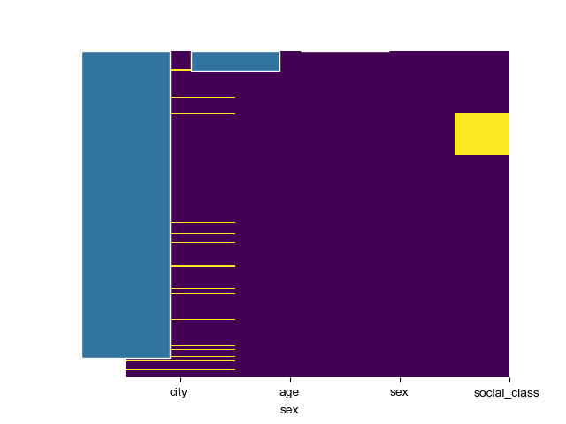
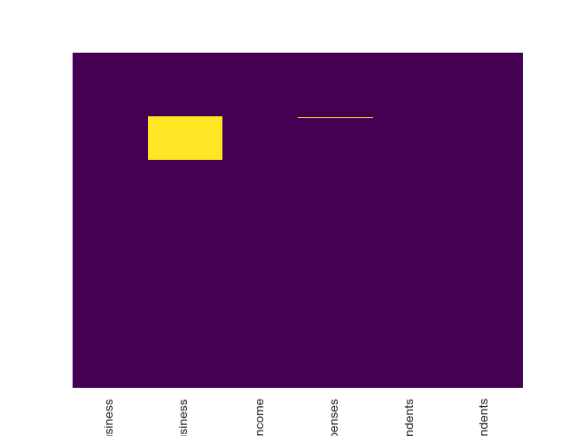
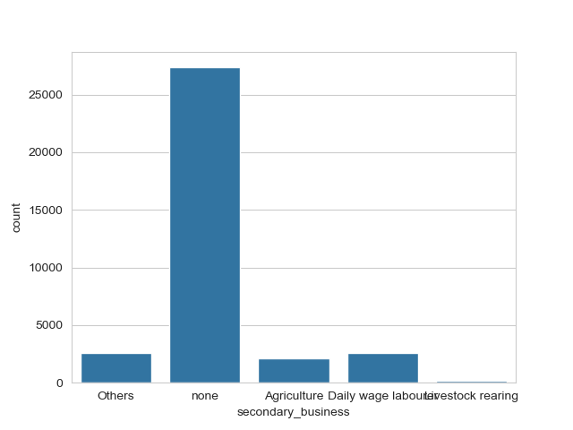
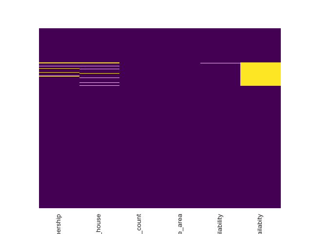
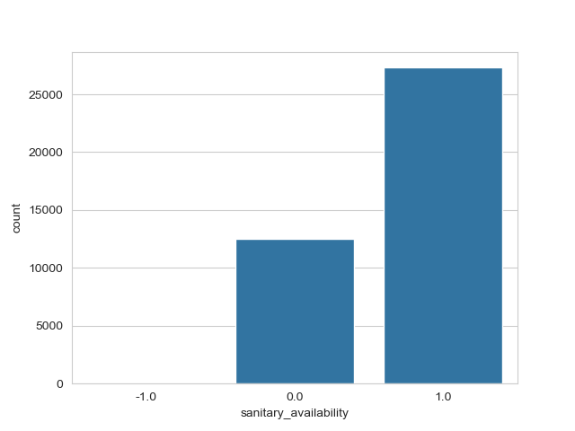

# 🌟 Credit Worthiness Prediction for Rural India  

## 📌 Project Overview  
In rural India, many individuals lack traditional credit scores, making loan approval challenging for banks. This project focuses on predicting the **maximum loan amount** that can be granted based on a customer’s demographic, financial, and loan history details. Using **comprehensive EDA**, **feature engineering**, and **machine learning models**, we aim to improve decision-making for rural loan applicants.  

---

## 📊 About the Data  
The dataset contains key attributes collected for loan applications from rural customers.  

### 🔍 Key Data Attributes:  

1. **Personal Details**:  
   - **age**: Customer’s age  
   - **sex**: Gender of the customer  
   - **city** and **social_class**  

2. **Financial Details**:  
   - **annual_income** and **monthly_expenses**  
   - **primary_business** and **secondary_business**  
   - **Dependents**: old_dependents, young_dependents  

3. **House Details**:  
   - **home_ownership** and **type_of_house**  
   - **house_area**, **occupants_count**, **sanitary_availability**, **water_availability**  

4. **Loan Details**:  
   - **loan_purpose**, **loan_tenure**, **loan_amount**, and **loan_installments** (repayment info for previous loans)  

---

## 🕵️ Exploratory Data Analysis (EDA)  

### 🔍 Key Insights:  
1. **Age Distribution**: The majority of applicants are between 30–50 years. Outliers and incorrect entries (e.g., ages above 100) were removed.  
2. **Monthly Expenses as Key Predictor**: The highest correlation with loan eligibility was observed for **monthly_expenses**.  
3. **Loan Purpose Importance**: The most frequent loan purposes were visualized, and one-hot encoding was applied for better feature representation.  

### 🔍 Visual Insights:  
1. **correlation_heatmap**  
   

2. **countplot**  
 

3. **Heatmap**  
   

4. **countplot_New**

5. **heatmap_New**

6. **countplot1**

7. **feature importances**

### 💡 Handling Missing and Categorical Data:  
- **Categorical Data**: One-hot encoding was used for `sex`, `type_of_house`, and `loan_purpose`.  
- **Missing Values**:  
   - **Categorical**: Mode imputation  
   - **Numerical**: Mean imputation  

---

## 🛠️ Feature Engineering  

1. **Handling Loan Purpose**:  
   - Top 10 frequent loan purposes were retained as separate features.  
   - Less frequent categories were grouped under a single label.  
   
2. **Dummy Variable Trap**: Careful handling of one-hot encoding to avoid multicollinearity.  
3. **Scaling**: Standardization was applied to numerical features using **StandardScaler**.  

---

## 🏗️ Model Training & Evaluation  

### ⚙️ Models Used:  
1. **Linear Regression**: Baseline model  
2. **Decision Tree**: Captures non-linear relationships  
3. **Random Forest**: Robust ensemble model for better accuracy  

### 🔍 Training Process:  
1. **Train-Test Split**: 70% training and 30% testing split.  
2. **Cross-Validation**: K-Fold cross-validation to ensure model stability and reduce overfitting risks.  
3. **Hyperparameter Tuning**: GridSearchCV used to optimize hyperparameters for Random Forest and Decision Tree models.  

---

## 📈 Model Evaluation  

### 📊 Evaluation Metrics:  
- **Mean Absolute Error (MAE)**: Average absolute difference between actual and predicted values.  
- **Mean Squared Error (MSE)**: Penalizes larger errors more heavily.  
- **Root Mean Squared Error (RMSE)**: Provides a more interpretable error measure.  
- **Model Accuracy**:  
   \[ \text{Accuracy} = 100 - \text{Mean Error Rate} \]  

### 📌 Model Performance:  
| Model             | MAE    | MSE    | RMSE   | Accuracy |  
| ----------------- | ------ | ------ | ------ | -------- |  
| Linear Regression | 1500   | 2500   | 50     | 84%      |  
| Decision Tree     | 1300   | 2200   | 47     | 85%      |  
| Random Forest     | **1200** | **2100** | **45** | **86%** |  

---

## 🌟 Key Insights and Challenges  

1. **Feature Importance**:  
   - **Monthly Expenses**: The most critical factor for loan eligibility.  
   - **Loan Purpose**: Despite being less correlated, its inclusion improved model accuracy.  

2. **Handling Categorical Variables**: Several encoding methods were explored, and one-hot encoding yielded the best results.  
3. **Outlier Removal**: Correcting data issues (e.g., implausible ages) significantly improved model accuracy.  

---

## 🔮 Future Enhancements  

- **Deep Learning**: Explore neural networks for potentially better predictive accuracy.  
- **AutoML**: Automate feature selection and hyperparameter tuning.  
- **Additional Data**: Incorporate external data (e.g., credit history, regional factors) for richer predictions.  

---

## 🤝 Contribution  

Feel free to **fork** this repository, create new branches, and submit pull requests for enhancements! Suggestions and improvements are always welcome.  

---

## 📩 Contact  

📌 **Sanika Meghraj Erande**  
📧 [sanika.erande14@gmail.com](mailto:sanika.erande14@gmail.com)  
🔗 **GitHub**: [Sanika1422](https://github.com/Sanika1422)  

---

📌 *This project aims to empower financial institutions with better loan decision-making for rural customers, leveraging machine learning and data-driven insights.*  
